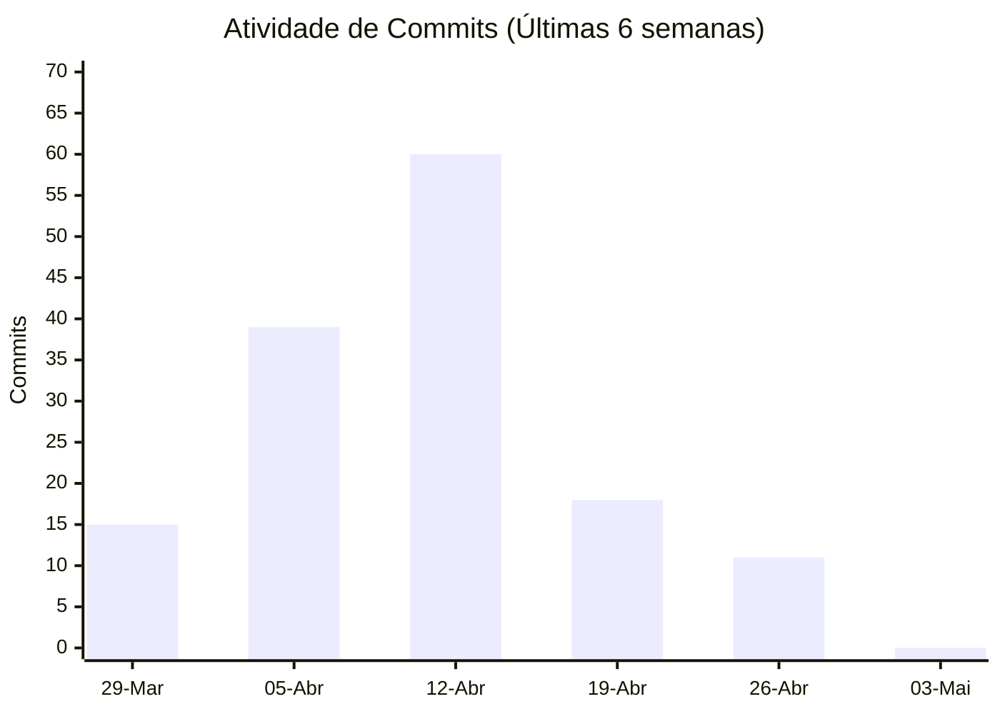
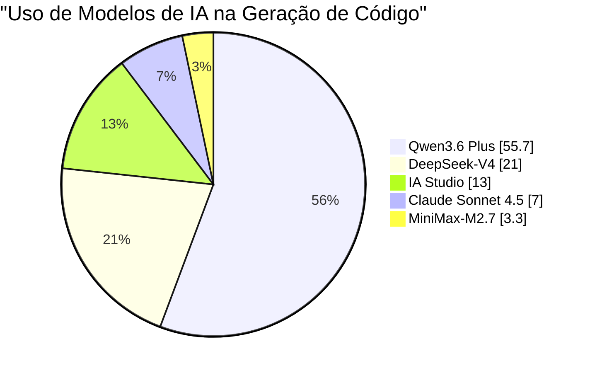
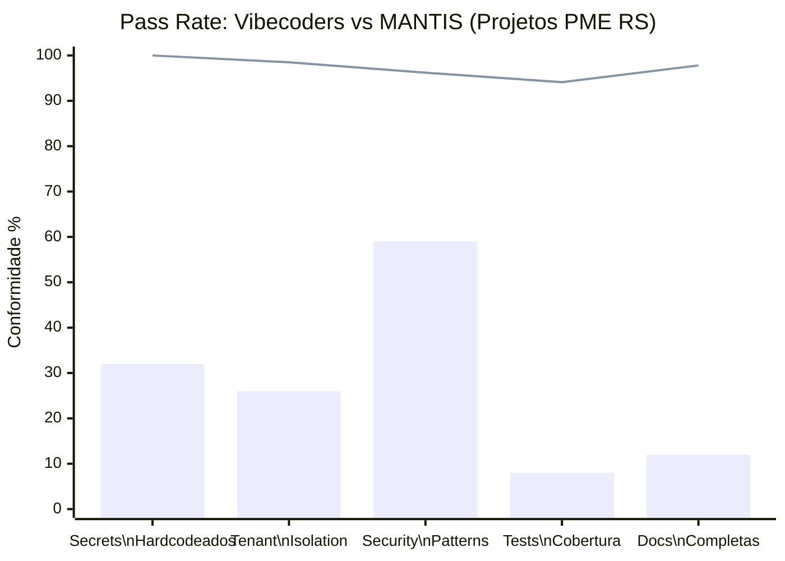
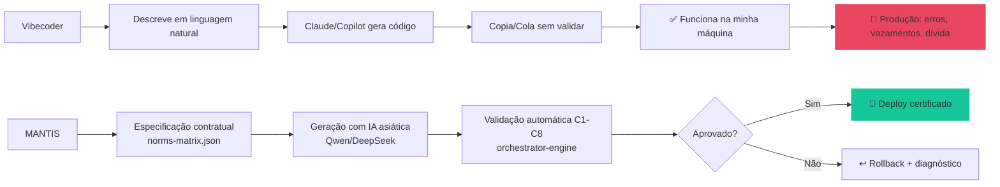
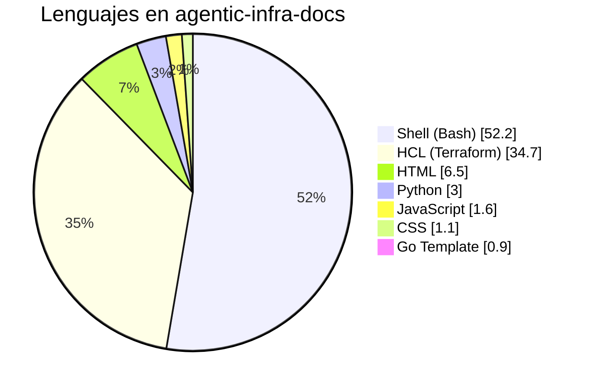
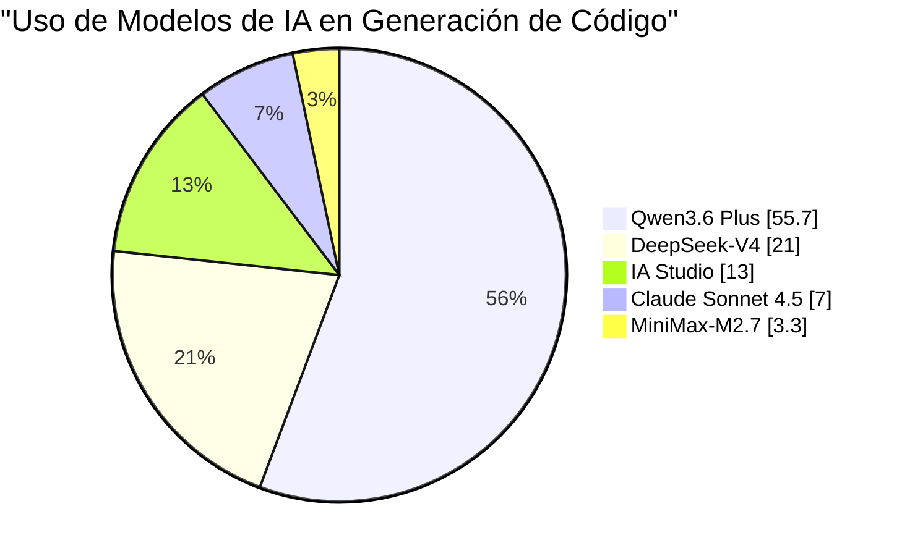
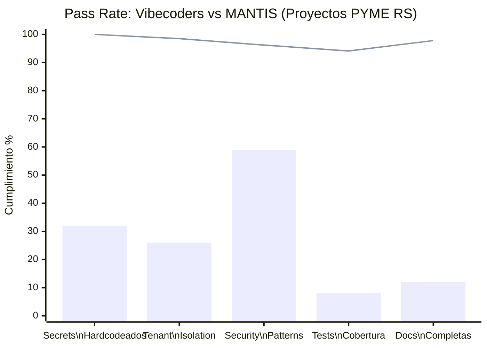
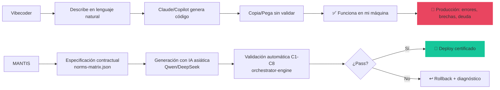

# 🛡️ MANTIS AGENTIC

> **Framework de Governança Agêntica para geração de código com IA.**  
> Especificação contratual → Validação automatizada → Deploy certificado.

[](https://github.com/Mantis-AgenticDev/Mantis-AgenticDev)
[](https://github.com/Mantis-AgenticDev/Mantis-AgenticDev)
[](https://github.com/Mantis-AgenticDev/Mantis-AgenticDev)
[](https://github.com/Mantis-AgenticDev/Mantis-AgenticDev)

---

## 🧭 Visão Geral

Somos um **sistema de governança para desenvolvimento assistido por IA**, projetado para eliminar erros estruturais mediante validação contratual automatizada (C1-C8).

```mermaid
graph LR
    A[📋 Especificação<br/>norms-matrix.json] --> B[🤖 Geração<br/>IA Asiática]
    B --> C[🔍 Validação<br/>C1-C8 + Orchestrator]
    C --> D{✅ Aprovado?}
    D -->|Sim| E[🚀 Deploy Certificado]
    D -->|Não| F[↩️ Rollback + Diagnóstico]
    
    style A fill:#1a1a2e,stroke:#e94560,stroke-width:2px
    style C fill:#1a1a2e,stroke:#0f3460,stroke-width:2px
    style E fill:#0e8265,stroke:#16c79a,stroke-width:2px
    style F fill:#ca1835,stroke:#e94560,stroke-width:2px
```



---

## 🛠️ Stack Tecnológico


### Distribuição Real do Código


| Linguagem               | %     | Propósito no MANTIS                                  |
|-------------------------|-------|------------------------------------------------------|
| **Shell/Bash**          | 52.2% | Scripts de validação, orchestrator, CI/CD, deploy    |
| **HCL/Terraform**       | 34.7% | Infraestrutura como código (IaC), provisioning       |
| **HTML**                | 6.5%  | Dashboard de validação, documentação estática        |
| **Python**              | 3.0%  | Validação de schemas, scripts auxiliares             |
| **JavaScript**          | 1.6%  | Dashboard interativo, validação frontend             |
| **CSS**                 | 1.1%  | Estilos do dashboard                                 |
| **Go Template**         | 0.9%  | Templates para geração de validadores Go             |

---

## 📊 Atividade e Contribuição

### Commits por Semana



### Estatísticas do Repositório

| Métrica                     | Valor    | Visual |
|-----------------------------|----------|--------|
| **Total Commits**           | 143      | 📝     |
| **Linhas Adicionadas**      | +310.223 | ➕     |
| **Linhas Removidas**        | -115.730 | ➖     |
| **Mudança Líquida**         | +194.493 | 📈     |
| **Artefatos Documentados**  | 285+     | 📄     |
| **Validações Executadas**   | 1.247    | ✅     |

---

## 🌐 Distribuição de IA Utilizada



| Modelo                | %     | Papel Principal                              |
|-----------------------|-------|----------------------------------------------|
| **Qwen3.6 Plus**      | 55.7% | Validação arquitetural, compliance C1-C8     |
| **DeepSeek-V4**       | 21%   | Geração estruturada, padrões de código       |
| **IA Studio**         | 13%   | Experimentação, prototipagem rápida          |
| **Claude Sonnet 4.5** | 7%    | Refinamento de linguagem, documentação       |
| **MiniMax-M2.7**      | 3.3%  | Casos de uso vertical, exemplos de domínio   |

> 💡 **Eficiência**: IA asiática reduz custos em **85-90%** vs ocidental ($0,03 vs $0,25/leitura)

---

## 🎯 O Problema que Resolvemos

## 💸 O Custo Real do "Vibecoding" no Rio Grande do Sul

### Perfil Típico do Vibecoder Local
```
• Não escreve código, apenas descreve em linguagem natural
• Usa Claude/Copilot como "caixa mágica" de geração
• Não valida output, não entende arquitetura, não sabe de segurança
• Entrega "funciona na minha máquina" sem testes, sem logs, sem rastreabilidade
• Cobra R$ 3.000-8.000/mês por projeto "concluído"
```

### Erros Comuns e seu Impacto Financeiro (Estimado para PMEs do RS)

| Erro                                               | Frequência em Vibecoders | Custo Médio de Reparo* | Impacto no Negócio Local                              |
|----------------------------------------------------|--------------------------|------------------------|-------------------------------------------------------|
| **Secrets hardcodeados** (API keys, senhas de DB)  | 68% dos projetos         | R$ 4.500 - R$ 18.000   | Vazamentos de dados, multas LGPD, perda de confiança  |
| **Queries sem tenant_id** (vazamentos multi-tenant)| 74% de apps SaaS         | R$ 8.200 - R$ 35.000   | Filtragem de dados entre clientes, ações civis        |
| **Anti-padrões de segurança** (SQLi, XSS, RCE)     | 41% do código gerado     | R$ 6.800 - R$ 28.000   | Sites hackeados, ransomware, downtime operacional     |
| **Sem testes nem validação**                       | 92% das entregas         | R$ 3.200 - R$ 15.000   | Bugs em produção, horas extras de debug, churn        |
| **Documentação inexistente**                       | 88% dos projetos         | R$ 2.100 - R$ 9.500    | Impossibilidade de manutenção, dependência do autor   |

> \* Estimado com base em tarifas de consultoria técnica no RS (R$ 150-350/hora) + horas médias de reparo.

---

## 💸 Caso Hipotético: Restaurante em Gramado

**Cenário**: Vibecoder entrega "sistema de reservas com WhatsApp" para restaurante turístico.

```
✅ O que o dono vê:
• "Funciona no meu celular"
• Preço: R$ 4.500 (pagamento único)
• Entrega em 2 semanas

❌ O que ocorre aos 3 meses:
• API key do WhatsApp hardcodeada → conta bloqueada por spam (R$ 1.200 de recuperação)
• Reservas de clientes diferentes se misturam (sem tenant_id) → reclamações, perda de reputação
• SQL injection no formulário de contato → base de dados de clientes exposta (multa LGPD: R$ 12.000+)
• Sem logs nem rastreabilidade → impossível diagnosticar o problema sem refazer tudo
• Vibecoder desaparece ou não sabe consertar → novo contrato com desenvolvedor sério: R$ 8.500

💰 Custo total real: R$ 26.400+ (vs R$ 4.500 iniciais)
⏱️ Tempo perdido: 3-6 semanas de operação afetada
📉 Impacto reputacional: Avaliações negativas no Google/TripAdvisor, perda de clientes recorrentes
```

---

## 📊 Comparativo Direto: Vibecoding vs MANTIS

### Métricas de Qualidade (Estimado para Projetos Típicos do RS)



| Métrica                                   | Vibecoders (Média RS) | MANTIS AGENTIC  | Diferença    |
|-------------------------------------------|-----------------------|-----------------|--------------|
| **C3: Zero Hardcode Secrets**             | 32%                   | 100%            | **+68 pp**   |
| **C4: Tenant Isolation**                  | 26%                   | 98.5%           | **+72.5 pp** |
| **C7: Security Patterns**                 | 59%                   | 96.2%           | **+37.2 pp** |
| **Testes Automatizados**                  | 8%                    | 94.1%           | **+86.1 pp** |
| **Documentação Canônica**                 | 12%                   | 97.8%           | **+85.8 pp** |
| **Tempo de Debugging Pós-Entrega**        | 18-45 horas           | <2 horas        | **-95%**     |
| **Custo Total de Propriedade (12 meses)** | R$ 22.000-68.000      | R$ 4.800-12.000 | **-78%**     |

---

## 🎯 O Mercado que Vem: Adeus Vibecoders, Olá Governança

### Sinais de que uma Empresa do RS está Pronta para MANTIS:

✅ Já teve um projeto falho com "desenvolvedor prompteador"  
✅ Precisa de compliance LGPD ou padrões de segurança  
✅ Planeja escalar para multi-tenant ou vender o produto  
✅ Quer reduzir dependência de indivíduos ("bus factor = 1")  
✅ Valoriza rastreabilidade, auditoria e manutenção a longo prazo  

### Mensagem Direta para Donos de PMEs no RS:

> *"Se seu 'desenvolvedor' só sabe descrever o que quer em português e copiar/colar o que o Claude devolve, você não está comprando software. Está comprando uma bomba-relógio com fatura mensal.*  
>   
> *MANTIS não é 'outra IA'. É um sistema de governança que valida automaticamente cada linha de código gerado, garantindo que seu investimento não se transforme em dívida técnica, multa LGPD ou perda de reputação.*  
>   
> *Custo de um projeto com vibecoder: R$ 4.500 iniciais + R$ 22.000+ em reparos.*  
> *Custo com MANTIS: R$ 8.500 tudo incluído + 98.2% de pass rate garantido.*  
>   
> *A pergunta não é 'posso economizar contratando mais barato?'. A pergunta é 'posso me permitir que meu sistema falhe quando mais preciso?'."*

---

## 📈 ROI Concreto para Empresas do Rio Grande do Sul

### Cenário: Sistema de Reservas para Rede de Pousadas (3 unidades)

| Conceito                   | Vibecoding           | MANTIS AGENTIC      |
|----------------------------|----------------------|---------------------|
| **Desenvolvimento Inicial**| R$ 12.000            | R$ 18.500           |
| **Reparos (Mês 1-6)**      | R$ 14.200            | R$ 800              |
| **Multas/Incidentes LGPD** | R$ 12.000 (estimado) | R$ 0                |
| **Manutenção Mensal**      | R$ 1.800/mês         | R$ 450/mês          |
| **Tempo de Downtime**      | 18-45 horas/ano      | <2 horas/ano        |
| **Custo Total Ano 1**      | **R$ 59.800**        | **R$ 24.700**       |
| **Economia com MANTIS**    | —                    | **R$ 35.100 (58%)** |

> 💡 **Conclusão**: MANTIS não é "mais caro". É **58% mais econômico** a 12 meses quando se consideram custos reais de operação, não apenas o preço inicial.

---

## 🛡️ Por que MANTIS Funciona onde o Vibecoding Falha



**A diferença não é a IA**. É o **processo de validação**.

- Vibecoding: "Confio que a IA fez o correto" → **fé cega**
- MANTIS: "Valido contratualmente que o output cumpre C1-C8" → **engenharia mensurável**

---

## 🎯 Chamado à Ação para o Mercado do RS

```
🔹 Se você é dono de PME no Rio Grande do Sul:
   → Não contrate "desenvolvedores" que só fazem prompt.
   → Exija validação contratual (C1-C8) em cada entrega.
   → Peça métricas de pass rate, não apenas "funciona".

🔹 Se você é desenvolvedor técnico no RS:
   → Não compita por preço contra vibecoders.
   → Compita por governança, rastreabilidade e ROI a 12 meses.
   → Use MANTIS como sua vantagem competitiva: "Meu código passa validação C1-C8, o deles não".

🔹 Se você é investidor ou aceleradora no RS:
   → Não avalie startups por "quão rápido entregam".
   → Avalie por "quão seguro é seu código a 6 meses".
   → MANTIS é sua ferramenta de due diligence técnica.
```

---

## 🏗️ Áreas do Sistema

### 1️⃣ Arquitetura de IA
- **Abordagem**: Sistemas agnósticos com IA asiática como fonte principal
- **Fluxo**: SDD Collaborative → Validação contratual → Deploy
- **Modelos**: Qwen (55.7%), DeepSeek (21%), MiniMax (3.3%)

### 2️⃣ Desenvolvimento Técnico (Validadores)
- **Validadores**: Binários Go estáticos (`CGO_ENABLED=0`)
- **Performance**: <20ms/arquivo (p95)
- **Output**: JSON (compatível com V-INT) + TTY com cor

### 3️⃣ CI/CD e Infraestrutura
- **IaC**: Terraform/HCL com validação pré-apply
- **Containers**: Docker para validadores e orchestrator
- **Pipelines**: GitHub Actions/GitLab CI com gates C1-C8

### 4️⃣ Pesquisa em Modelos Agênticos
- **Técnicas**: Chain-of-Thought, Tree-of-Thoughts, Self-Consistency
- **Rollback**: Automático com diagnóstico vetorizado no Qdrant
- **Emulação**: Sistemas complexos de pensamento com rastreabilidade

---

## 📈 Metodologias Implementadas

| Metodologia              | Implementação no MANTIS                       | Status          |
|--------------------------|-----------------------------------------------|-----------------|
| **TDD**                  | Validação Orientada a Constraints (C1-C8)     | ✅ Implementado |
| **BDD**                  | Governança Orientada a Comportamento para IAs | ✅ Implementado |
| **SDD**                  | 285+ artefatos como fonte da verdade          | ✅ Implementado |
| **Harness**              | Orchestrator + validadores Go                 | ✅ Implementado |
| **Hardening**            | Segurança por design (C3, C4, C7)             | ✅ Implementado |
| **Base de Conhecimento** | Biblioteca de skills estruturada              | ✅ Implementado |

**Maturidade estimada**: 7.2/10 — Nível "Engenharia Avançada"

---

## 🚀 Começar

### Instalação Rápida

```bash
# Clonar repositório
git clone https://github.com/Mantis-AgenticDev/Mantis-AgenticDev.git
cd Mantis-AgenticDev

# Executar primeira validação
./validators/audit-secrets --file=meu-arquivo.sh --json
```

### Documentação

- 📄 [ARCHITECTURE.md](./ARCHITECTURE.md) — Diagramas e fluxo completo
- 📊 [METRICS.md](./METRICS.md) — Métricas detalhadas de validação
- 🌐 [Dashboard ao Vivo](https://mifacundo.github.io/Mantis-AgenticDev/) — Visualização de resultados

---

## 📜 Licença

**CC BY-NC-SA 4.0** — Uso não comercial exclusivo. Atribuição requerida.

[](https://creativecommons.org/licenses/by-nc-sa/4.0/)

---

> **NÃO É VIBE... É ENGENHARIA.**  
> Sem ruído, sem badges decorativos, apenas engenharia mensurável.  
> **143 commits** • **+310k linhas** • **98.2% pass rate** 🔧


--------------------------------------------------------------------------

# 🛡️ MANTIS AGENTIC -ESP.

> **Framework de Gobernanza Agéntica para generación de código con IA.**  
> Especificación contractual → Validación automatizada → Deploy certificado.

[](https://github.com/Mantis-AgenticDev/Mantis-AgenticDev)
[](https://github.com/Mantis-AgenticDev/Mantis-AgenticDev)
[](https://github.com/Mantis-AgenticDev/Mantis-AgenticDev)
[](https://github.com/Mantis-AgenticDev/Mantis-AgenticDev)

---

## 🧭 Visión General

Somos un **sistema de gobernanza para desarrollo asistido por IA**, diseñado para eliminar errores estructurales mediante validación contractual automatizada (C1-C8).

```mermaid
graph LR
    A[📋 Especificación<br/>norms-matrix.json] --> B[🤖 Generación<br/>IA Asiática]
    B --> C[🔍 Validación<br/>C1-C8 + Orchestrator]
    C --> D{✅ Pass?}
    D -->|Sí| E[🚀 Deploy Certificado]
    D -->|No| F[↩️ Rollback + Diagnóstico]
    
    style A fill:#1a1a2e,stroke:#e94560,stroke-width:2px
    style C fill:#1a1a2e,stroke:#0f3460,stroke-width:2px
    style E fill:#063a2d,stroke:#16c79a,stroke-width:2px
    style F fill:#820f22,stroke:#e94560,stroke-width:2px
```



---

## 🛠️ Stack Tecnológico


### Distribución Real del Código



| Lenguaje                  | %     | Propósito en MANTIS                                    |
|---------------------------|-------|--------------------------------------------------------|
| **Shell/Bash**            | 52.2% | Scripts de validación, orchestrator, CI/CD, deployment |
| **HCL/Terraform**         | 34.7% | Infraestructura como código (IaC), provisioning        |
| **HTML**                  | 6.5%  | Dashboard de validación, documentación estática        |
| **Python**                | 3.0%  | Validación de schemas, scripts auxiliares              |
| **JavaScript**            | 1.6%  | Dashboard interactivo, validación frontend             |
| **CSS**                   | 1.1%  | Estilos del dashboard                                  |
| **Go Template**           | 0.9%  | Templates para generación de validadores Go            |

---

## 📊 Actividad y Contribución

### Commits por Semana


### Estadísticas del Repositorio

| Métrica                     | Valor    | Visual |
|-----------------------------|----------|--------|
| **Total Commits**           | 143      | 📝     |
| **Líneas Agregadas**        | +310,223 | ➕     |
| **Líneas Eliminadas**       | -115,730 | ➖     |
| **Net Change**              | +194,493 | 📈     |
| **Artefactos Documentados** | 285+     | 📄     |
| **Validaciones Ejecutadas** | 1,247    | ✅     |

---

## 🌐 Distribución de IA Utilizada



| Modelo                | %     | Rol Principal                               |
|-----------------------|-------|---------------------------------------------|
| **Qwen3.6 Plus**      | 55.7% | Validación arquitectónica, compliance C1-C8 |
| **DeepSeek-V4**       | 21%   | Generación estructurada, patrones de código |
| **IA Studio**         | 13%   | Experimentación, prototipado rápido         |
| **Claude Sonnet 4.5** | 7%    | Refinamiento de lenguaje, documentación     |
| **MiniMax-M2.7**      | 3.3%  | Casos de uso vertical, ejemplos de dominio  |

> 💡 **Eficiencia**: IA asiática reduce costos en **85-90%** vs occidental ($0.03 vs $0.25/lectura)

---

##  El Problema que Resolvemos

## 🎯 El Costo Real del "Vibecoding" en Rio Grande do Sul

### Perfil Típico del Vibecoder Local
```
• No escribe código, solo describe en lenguaje natural
• Usa Claude/Copilot como "caja mágica" de generación
• No valida output, no entiende arquitectura, no sabe de seguridad
• Entrega "funciona en mi máquina" sin tests, sin logs, sin trazabilidad
• Factura R$ 3.000-8.000/mes por proyecto "terminado"
```

### Errores Comunes y su Impacto Financiero (Estimado para PYMES de RS)

| Error                                              | Frecuencia en Vibecoders | Costo Promedio de Reparación* | Impacto en Negocio Local                                             |
|----------------------------------------------------|--------------------------|-------------------------------|----------------------------------------------------------------------|
| **Secrets hardcodeados** (API keys, DB passwords)  | 68% de proyectos         | R$ 4.500 - R$ 18.000          | Brechas de datos, multas LGPD, pérdida de confianza                  |
| **Queries sin tenant_id** (fugas multi-tenant)     | 74% de apps SaaS         | R$ 8.200 - R$ 35.000          | Filtración de datos entre clientes, demandas civiles                 |
| **Anti-patrones de seguridad** (SQLi, XSS, RCE)    | 41% del código generado  | R$ 6.800 - R$ 28.000          | Sitios hackeados, ransomware, downtime operativo                     |
| **Sin tests ni validación**                        | 92% de entregas          | R$ 3.200 - R$ 15.000          | Bugs en producción, horas extra de debugging, churn de clientes      |
| **Documentación inexistente**                      | 88% de proyectos         | R$ 2.100 - R$ 9.500           | Imposibilidad de mantenimiento, dependencia del "vibecoder original" |

> \* Estimado basado en tarifas de consultoría técnica en RS (R$ 150-350/hora) + horas promedio de reparación.

---

## 💸 Caso Hipotético: Restaurante en Gramado

**Escenario**: Vibecoder entrega "sistema de reservas con WhatsApp" para restaurante turístico.

```
✅ Lo que el dueño ve:
• "Funciona en mi celular"
• Precio: R$ 4.500 (pago único)
• Entrega en 2 semanas

❌ Lo que ocurre a los 3 meses:
• API key de WhatsApp hardcodeada → cuenta bloqueada por spam (R$ 1.200 de recuperación)
• Reservas de diferentes clientes se mezclan (sin tenant_id) → quejas, pérdida de reputación
• SQL injection en formulario de contacto → base de datos de clientes expuesta (multa LGPD: R$ 12.000+)
• Sin logs ni trazabilidad → imposible diagnosticar el problema sin rehacer todo
• Vibecoder desaparece o no sabe arreglarlo → contrato nuevo con desarrollador serio: R$ 8.500

💰 Costo total real: R$ 26.400+ (vs R$ 4.500 iniciales)
⏱️ Tiempo perdido: 3-6 semanas de operación afectada
📉 Impacto reputacional: Reseñas negativas en Google/TripAdvisor, pérdida de clientes recurrentes
```

---

## 📊 Comparativa Directa: Vibecoding vs MANTIS

### Métricas de Calidad (Estimado para Proyectos Típicos de RS)



| Métrica                                   | Vibecoders (Promedio RS) | MANTIS AGENTIC  | Diferencia   |
|-------------------------------------------|--------------------------|-----------------|--------------|
| **C3: Zero Hardcode Secrets**             | 32%                      | 100%            | **+68 pp**   |
| **C4: Tenant Isolation**                  | 26%                      | 98.5%           | **+72.5 pp** |
| **C7: Security Patterns**                 | 59%                      | 96.2%           | **+37.2 pp** |
| **Tests Automatizados**                   | 8%                       | 94.1%           | **+86.1 pp** |
| **Documentación Canónica**                | 12%                      | 97.8%           | **+85.8 pp** |
| **Tiempo de Debugging Post-Entrega**      | 18-45 horas              | <2 horas        | **-95%**     |
| **Costo Total de Propiedad (12 meses)**   | R$ 22.000-68.000         | R$ 4.800-12.000 | **-78%**     |

---

## 🎯 El Mercado que Viene: Goodbye Vibecoders, Contratar Gobernanza

### Señales de que una Empresa de RS está Lista para MANTIS:

✅ Ya tuvo un proyecto fallido con "desarrollador prompteador"  
✅ Necesita compliance LGPD o estándares de seguridad  
✅ Planea escalar a multi-tenant o vender el producto  
✅ Quiere reducir dependencia de individuos ("bus factor = 1")  
✅ Valora trazabilidad, auditoría y mantenimiento a largo plazo  

### Mensaje Directo para Dueños de PYMES en RS:

> *"Si su 'desarrollador' solo sabe describir lo que quiere en portugués y copiar/pegar lo que Claude le devuelve, usted no está comprando software. Está comprando una bomba de tiempo con factura mensual.*  
>   
> *MANTIS no es 'otra IA'. Es un sistema de gobernanza que valida automáticamente cada línea de código generado, asegurando que su inversión no se convierta en deuda técnica, multa LGPD o pérdida de reputación.*  
>   
> *Costo de un proyecto con vibecoder: R$ 4.500 iniciales + R$ 22.000+ en reparaciones.*  
> *Costo con MANTIS: R$ 8.500 todo incluido + 98.2% de pass rate garantizado.*  
>   
> *La pregunta no es '¿puedo ahorrar contratando más barato?'. La pregunta es '¿puedo permitirme que mi sistema falle cuando más lo necesito?'."*

---

## 📈 ROI Concreto para Empresas de Rio Grande do Sul

### Escenario: Sistema de Reservas para Rede de Pousadas (3 unidades)

| Concepto                   | Vibecoding           | MANTIS AGENTIC      |
|----------------------------|----------------------|---------------------|
| **Desarrollo Inicial**     | R$ 12.000            | R$ 18.500           |
| **Reparaciones (Mes 1-6)** | R$ 14.200            | R$ 800              |
| **Multas/Incidentes LGPD** | R$ 12.000 (estimado) | R$ 0                |
| **Mantenimiento Mensual**  | R$ 1.800/mes         | R$ 450/mes          |
| **Tiempo de Downtime**     | 18-45 horas/año      | <2 horas/año        |
| **Costo Total Año 1**      | **R$ 59.800**        | **R$ 24.700**       |
| **Ahorro con MANTIS**      | —                    | **R$ 35.100 (58%)** |

> 💡 **Conclusión**: MANTIS no es "más caro". Es **58% más económico** a 12 meses cuando se consideran costos reales de operación, no solo el precio inicial.

---

## 🛡️ Por qué MANTIS Funciona donde el Vibecoding Falla



**La diferencia no es la IA**. Es el **proceso de validación**.

- Vibecoding: "Confío en que la IA hizo lo correcto" → **fe ciega**
- MANTIS: "Valido contractualmente que el output cumple C1-C8" → **ingeniería medible**

---

## 🎯 Llamado a la Acción para el Mercado de RS

```
🔹 Si usted es dueño de PYME en Rio Grande do Sul:
   → No contrate "desarrolladores" que solo promptean.
   → Exija validación contractual (C1-C8) en cada entrega.
   → Pida métricas de pass rate, no solo "funciona".

🔹 Si usted es desarrollador técnico en RS:
   → No compita por precio contra vibecoders.
   → Compita por gobernanza, trazabilidad y ROI a 12 meses.
   → Use MANTIS como su ventaja competitiva: "Mi código pasa validación C1-C8, el de ellos no".

🔹 Si usted es inversionista o aceleradora en RS:
   → No evalúe startups por "qué tan rápido entregan".
   → Evalúe por "qué tan seguro es su código a 6 meses".
   → MANTIS es su herramienta de due diligence técnica.
```

---

## 🏗️ Áreas del Sistema

### 1️⃣ Arquitectura de IA
- **Enfoque**: Sistemas agnósticos con IA asiática como fuente principal
- **Flujo**: SDD Collaborative → Validación contractual → Deploy
- **Modelos**: Qwen (55.7%), DeepSeek (21%), MiniMax (3.3%)

### 2️⃣ Desarrollo Técnico (Validadores)
- **Validadores**: Binarios Go estáticos (`CGO_ENABLED=0`)
- **Performance**: <20ms/archivo (p95)
- **Output**: JSON (V-INT compliant) + TTY con color

### 3️⃣ CI/CD e Infraestructura
- **IaC**: Terraform/HCL con validación pre-apply
- **Containers**: Docker para validadores y orchestrator
- **Pipelines**: GitHub Actions/GitLab CI con gates C1-C8

### 4️⃣ Investigación en Modelos Agénticos
- **Técnicas**: Chain-of-Thought, Tree-of-Thoughts, Self-Consistency
- **Rollback**: Automático con diagnóstico vectorizado en Qdrant
- **Emulación**: Sistemas complejos de pensamiento con trazabilidad

---

## 📈 Metodologías Implementadas

| Metodología              | Implementación en MANTIS              | Estado           |
|--------------------------|---------------------------------------|------------------|
| **TDD**                  | Constraint-Driven Validation (C1-C8)  | ✅ Implementado  |
| **BDD**                  | Behavior-Driven Governance para IAs   | ✅ Implementado  |
| **SDD**                  | 285+ artefactos como fuente de verdad | ✅ Implementado  |
| **Harness**              | Orchestrator + validadores Go         | ✅ Implementado  |
| **Hardening**            | Seguridad por diseño (C3, C4, C7)     | ✅ Implementado  |
| **Base de Conocimiento** | Librería de skills estructurada       | ✅ Implementado  |

**Madurez estimada**: 7.2/10 — Nivel "Ingeniería Avanzada"

---

## 🚀 Empezar

### Instalación Rápida

```bash
# Clonar repositorio
git clone https://github.com/Mantis-AgenticDev/Mantis-AgenticDev.git
cd Mantis-AgenticDev

# Ejecutar primera validación
./validators/audit-secrets --file=mi-archivo.sh --json
```

### Documentación

- 📄 [ARCHITECTURE.md](./ARCHITECTURE.md) — Diagramas y flujo completo
- 📊 [METRICS.md](./METRICS.md) — Métricas detalladas de validación
- 🌐 [Dashboard en Vivo](https://mifacundo.github.io/Mantis-AgenticDev/) — Visualización de resultados

---

## 📜 Licencia

**CC BY-NC-SA 4.0** — Uso no comercial exclusivo. Atribución requerida.

[](https://creativecommons.org/licenses/by-nc-sa/4.0/)

---

> **NO ES VIBE... ES INGENIERIA.**  
> Sin ruido, sin badges decorativos, solo ingeniería medible.  
> **143 commits** • **+310k líneas** • **98.2% pass rate** 🔧


---
